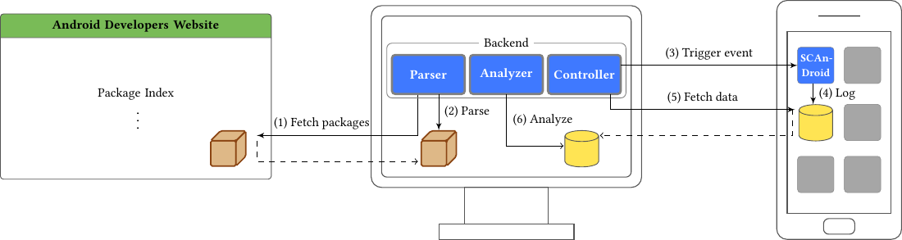

# SCAnDroid

> This is the Proof-of-Concept implementation of SCAnDroid, a tool published at WiSec 2018.
> See the "[SCAnDroid](https://rspreitzer.github.io/publications/proc/wisec-2018-paper-2.pdf)" paper by Spreitzer, Palfinger, and Mangard for more details.

This repository contains a tool to analyze the Android API for possible information leaks. SCAnDroid relies on the concept of template attacks. Thus, it works without prior knowledge about possible information leaks. 

## Design of SCAnDroid
The following figure illustrates the design of SCAnDroid, which consists of an Android app (SCAnDroid) and the Backend. The Backend consists of a tool to fetch and parse packages of the Android API, a tool to control the Android app as well as the Android device via the [Android Debug Bridge (ADB)](https://developer.android.com/studio/command-line/adb), and a tool to analyze the gathered information. The Analyzer and the Controller component are based on the "[ProcHarvester](https://github.com/IAIK/ProcHarvester)" framework. 

The basic work flow is as follows:

1. **Fetch packages:** The Parser component fetches a list of available constructors, and methods from the [Android Developers website](https://developer.android.com/reference/packages.html). 
2. **Parse:** The Parser component parses the information to extract a list of methods to be profiled. 
3. **Trigger event:** The Controller component triggers events, such as website launches, Google Maps search queries, or app starts, on the device. 
4. **Log:** The Android app (SCAnDroid) relies on Java Reflections to create all objects and profiles/invokes Android APIs, while events are being triggered. 
5. **Fetch data:** After the profiling phase, the log files are fetched to the Backend. 
4. **Analyze:** The log files are analyzed to identify information leaks that allow inferring the triggered events. 

## Evaluation
We used SCAnDroid to analyze information leaks that allow inferring the following events from Android APIs:
* Website launches
* Google Maps search queries
* App starts

## One note before starting
**Warning:** This code is provided as-is. You are responsible for protecting yourself, your property and data, and others from any risks caused by this code. This code may not detect vulnerabilities in your application/OS or device. This code is only for testing purposes. Use it only on test systems which contain no sensitive data.

